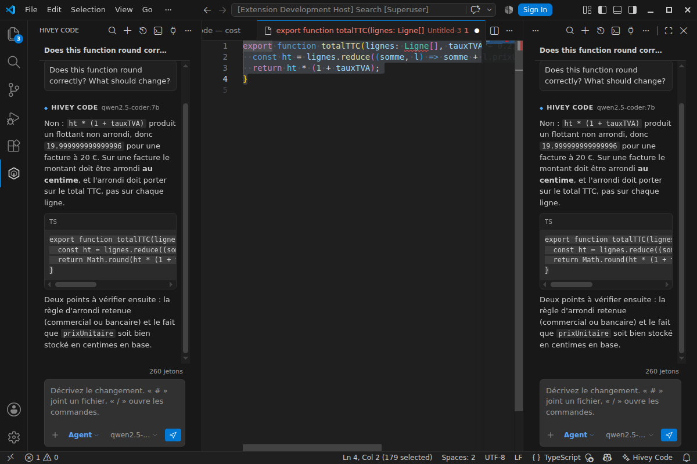
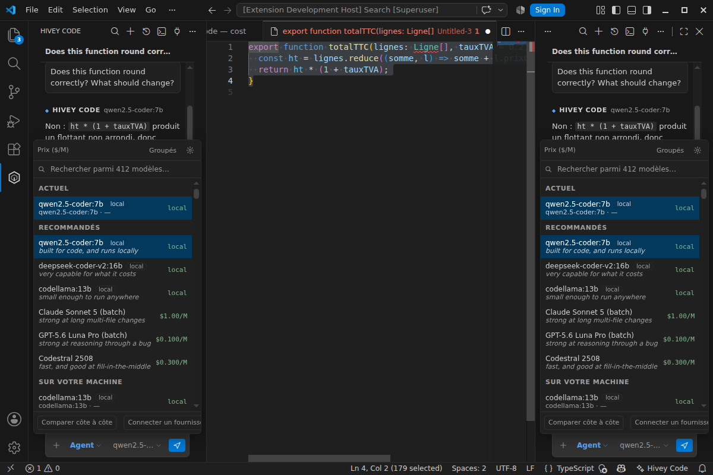
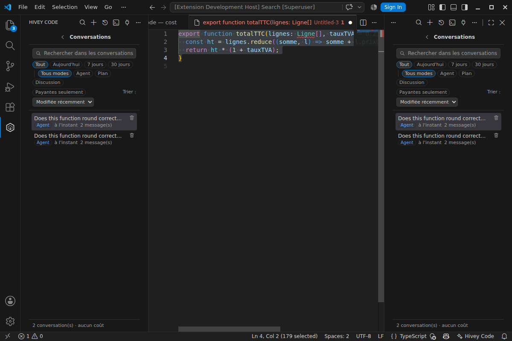

# Hivey Code

*[English](README.md)*

**Un assistant de code pour VS Code qui ne fait pas sortir votre code.**
Modèles locaux (Ollama, LM Studio, vLLM, llama.cpp) ou passerelle distante (OpenRouter, Azure,
LiteLLM, Anthropic) — au choix, par rôle, et **anonymisé quand ça sort**.

Open source (Apache-2.0), **zéro dépendance à l'exécution**, **zéro télémétrie**.



*Captures réelles, prises dans un VS Code lancé par la suite d'intégration. Seul le modèle qui
répond est un serveur de test ; l'interface, elle, est le produit.*

| Choisir un modèle | Conversations |
|---|---|
|  |  |

---

## Pourquoi

GitHub Copilot est excellent et pose deux problèmes à une entreprise :

1. **Le code part.** Chaque frappe, chaque fichier ouvert, chaque question part chez un tiers.
   Pour beaucoup d'équipes — santé, défense, banque, sous-traitance sous NDA — ce point suffit à
   fermer le dossier.
2. **Le coût est structurel.** Le produit envoie tout à un gros modèle distant, parce que c'est le
   produit. On paie par développeur, tous les mois, pour des complétions dont 90 % sont triviales.

Hivey Code inverse les deux : **le défaut est le modèle qui tourne déjà sur votre machine**, le
modèle distant est une **escalade** qu'il faut justifier, consentir et payer sur un budget ; et tout
ce qui sort est **anonymisé de façon réversible** avant de partir.

## Ce que ça sait faire

| | |
|---|---|
| **Complétion inline** | Remplissage au milieu (FIM) avec le modèle de code local. Anti-rebond, annulation, cache « frappe à travers » qui sert la suite d'une suggestion **sans requête**. |
| **Discussion en barre latérale** | Streaming, pièces jointes (fichier actif, sélection, fichiers choisis), historique par espace de travail, choix du modèle, compteur de contexte et de coût. |
| **Mode agent** | L'assistant lit le dépôt, cherche, consulte les **diagnostics de l'éditeur**, modifie des fichiers et propose des commandes — **une approbation par action**, diff avant écriture, tout dans la pile d'annulation. |
| **Terminal** | La commande `hivey-code` : le même noyau, en REPL, avec la sortie des commandes réellement capturée et un diff imprimé avant chaque écriture. |
| **Dans l'éditeur** | `Ctrl+I` réécrit la sélection sur place · clic droit → interroger la sélection · message de commit rédigé depuis l'index · « expliquer la sortie du terminal ». |
| **Correctifs rapides** | Sur une erreur signalée par votre serveur de langage : « Corriger avec Hivey Code » et « Expliquer ce problème ». Le compilateur dit **quoi** et **où** ; le modèle n'a plus qu'à corriger — c'est ce qui rend un petit modèle local suffisant sur la majorité des cas. |
| **Raccourcis de saisie** | `#` ouvre le sélecteur de fichiers de VS Code · `/expliquer`, `/tests`, `/corriger`, `/revue`, `/doc` joignent le fichier actif et posent la bonne question. |
| **Trois modes** | **Discussion** (aucun outil), **Plan** (lit le dépôt, ne modifie rien), **Agent** (lit, modifie, propose des commandes). Le mode décide de l'outillage **dans le code** : en mode Plan, aucun outil d'écriture n'existe — ce n'est pas une consigne dans un prompt. |
| **Raisonnement** | Budget de réflexion réglable (direct / bref / standard / approfondi), traduit pour chaque fournisseur — `reasoning.effort` chez OpenRouter, un budget de jetons chez Anthropic. Le texte de réflexion s'affiche dans un bloc repliable et n'est jamais renvoyé au modèle. |
| **Permissions** | Par action et par forme d'action : « autoriser une fois », « pour cette conversation », « toujours ». Autoriser `npm test` n'autorise pas `npm publish`. Un écran dédié liste ce qui est permanent et ce qui expire. |
| **Notation de contexte** | `#file:`, `#selection`, `#changes`, `#problems`, `#codebase`, `#terminal`, `#sym:` — la notation de Copilot, parce qu'on ne devrait pas avoir à en apprendre une seconde. Résolue **sur votre machine** avant tout envoi, ce qui est précisément ce qui permet à `#changes` de joindre du code non publié à une conversation avec un modèle local. |
| **Participants** | `@workspace`, `@editor`, `@terminal`, `@git`, `@ibmi`, `@arcad` — une indication d'où regarder en premier, pas une autre personnalité. |
| **Règles de la maison** | `.github/copilot-instructions.md` est lu tel quel : une équipe qui en a un ne devrait pas l'écrire deux fois. `.hiveycode/instructions.md` l'emporte si les deux existent. |
| **Git** | État, diff, journal, annotation, contenu à une révision, branches, indexation, commit — par l'API de l'extension Git intégrée, pas par un shell. Ne pousse jamais. |
| **IBM i** | Db2 for i, commandes CL, membres source, listes d'objets et liste de bibliothèques, sur la connexion que Code for IBM i a déjà négociée. Et la partie qui décide si le code compile : **le dialecte est détecté d'après le membre, et ses règles de colonnes entrent dans le prompt** — RPG III, RPGLE fixe et libre, SQLRPGLE, CL, DDS (PF/LF/DSPF/PRTF), Db2 for i, COBOL. |
| **ARCAD Elias** | Check-out, check-in, compilation, références croisées et la conversion Transformer RPG, par les commandes `arcad.*` qu'Elias enregistre lui-même — plus des appels au serveur REST déjà configuré. |
| **MCP** | Branchez n'importe quel serveur Model Context Protocol, stdio ou HTTP. Ses outils rejoignent l'ensemble, sous les mêmes permissions. Un serveur local ne démarre jamais sans votre accord, dans une fenêtre qui nomme la commande. |
| **Vos propres compétences** | Des fichiers Markdown dans `.hiveycode/skills/`, versionnés avec le code qu'ils régissent. Invoqués par `/nom`, ou choisis par le modèle quand la description correspond. |
| **Vos propres sous-agents** | `.hiveycode/agents/` : un prompt, une liste d'outils et un modèle à eux, sur un contexte vierge. Leurs outils sont **intersectés** avec ce que le mode autorise — jamais ajoutés. |
| **Recherche** | Dans la conversation ouverte (`Ctrl+F`, résultats surlignés) **et** dans tout l'historique — la recherche regarde à l'intérieur des messages et montre le fragment qui correspond. |
| **Filtres d'historique** | Période, mode, « payantes seulement », tri par dernière modification / création / longueur / coût. |
| **Contrôle du contexte** | Chaque échange peut être **rendu muet** (il reste affiché, il ne part plus), **épinglé** (il survit à la coupe), modifié ou supprimé. C'est le levier le plus direct sur la qualité **et** sur la facture. |
| **Confidentialité** | Anonymisation réversible, fichiers interdits, consentement avant la première destination, **journal des envois** et **rapport de coûts**. |
| **Langues** | Anglais et français, selon la langue d'affichage de l'éditeur — ou fixée par `hiveyCode.language`, pour un poste dont l'éditeur est dans une langue et l'utilisateur dans une autre. |
| **Votre thème** | Chaque couleur du panneau est une variable de l'éditeur. Pas une seule valeur en dur — [le même sélecteur sous un thème clair](docs/images/picker.light.png), pris par le même script. Il suit un changement de thème immédiatement, contraste élevé compris. |

## Comment le coût tend vers zéro

Ce n'est pas un slogan, c'est une architecture. Cinq leviers, dans l'ordre de leur effet :

1. **La complétion ne s'escalade jamais.** C'est le trafic à haute fréquence — une requête par pause
   de frappe. Elle tourne sur un modèle de code local (7 B suffit) et coûte de l'électricité.
   Le routeur l'interdit d'escalade *quelle que soit* la politique configurée.
2. **On envoie une carte, pas le territoire.** Le contexte ambiant est une **carte du dépôt**
   (chemins + symboles de tête, extraits sans parseur natif), pas le contenu des fichiers. Quelques
   milliers de jetons décrivent un dépôt cent fois plus gros, et le modèle demande les deux fichiers
   qu'il lui faut au lieu qu'on lui en pousse quarante.
3. **Le cache de prompt.** Le préfixe stable (prompt système + carte du dépôt) est marqué
   `cache_control` sur Anthropic et bénéficie du cache implicite ailleurs. Une conversation de code
   renvoie presque le même contexte à chaque tour : c'est là que se joue l'essentiel de la facture.
4. **On ne demande pas quand c'est inutile.** Pas de requête au milieu d'un mot, ni devant du code
   existant, ni pour un contexte dont on sait déjà que le modèle n'a rien à dire ; et la suite d'une
   suggestion déjà obtenue est servie depuis le cache pendant que l'utilisateur la tape.
5. **Un budget qui refuse.** Plafond par requête (une invite emballée ne coûte pas un dîner) et
   plafond par jour, vérifiés **avant** l'appel sur une estimation, enregistrés **après** sur le coût
   réel quand le fournisseur le communique (OpenRouter le fait).

Résultat par défaut : **0 $**. Le premier centime dépensé est un choix explicite.

## Comment la confidentialité est tenue

Quatre étapes, dans cet ordre, sur tout ce qui part vers un fournisseur distant :

1. **Interdiction.** Un fichier qui correspond à `privacy.blockedGlobs` (`.env`, clés, `secrets/**`…)
   n'est jamais joint, ni en discussion, ni en complétion.
2. **Anonymisation réversible.** Identifiants (formes connues + filet à entropie), adresses e-mail,
   téléphones, IP, hôtes internes, comptes dans les chemins, et les **termes propres à votre
   organisation** que vous listez. `alice@corp.fr` devient `⟨EMAIL_1⟩` — **partout et toujours le
   même marqueur**, pour que le modèle puisse encore raisonner — et redevient `alice@corp.fr` chez
   vous, y compris dans le code qu'il renvoie.
3. **Refus.** Un secret détecté déclenche un avertissement modal ; il est de toute façon déjà
   remplacé. L'anonymisation « off » ne s'applique jamais aux identifiants : la vie privée est une
   préférence, un mot de passe n'en est pas une.
4. **Consentement.** Avant la première requête vers une destination donnée : ce qui part (volume,
   destination, modèle) et ce qui a été masqué.

Ensuite, **la preuve** : `Hivey Code : Aperçu des données sortantes` liste chaque envoi distant —
horodatage, hôte, modèle, jetons, part servie par le cache, coût, catégories anonymisées. **Jamais
le contenu** : un journal de ce qu'on voulait garder privé n'est pas une fonction de confidentialité.

Les points où d'autres se trompent, et qui sont traités ici :

- **Le point de terminaison décide, pas le nom du réglage.** Pointer le fournisseur « local » vers
  une URL publique déclenche l'anonymisation et le consentement comme n'importe quel autre.
- **Chaque étape de l'agent repasse la porte.** Un fichier que l'agent vient de lire est du texte
  neuf : il est ré-anonymisé avant l'appel suivant.
- **Le contenu joint est cloisonné.** Fichiers, journaux et pages arrivent dans un bloc clos par un
  **nonce par tour** ; une injection cachée dans un fichier ne peut pas fermer un bloc dont elle
  ignore le délimiteur.
- **Les clés vivent dans le trousseau du système** (`SecretStorage`), jamais dans `settings.json`
  — qui se synchronise et se committe par accident.

## Installation

```bash
git clone https://github.com/FlorianMartins/hivey-vscode
cd hivey-code
npm ci
npm run build
npx @vscode/vsce package --no-dependencies   # produit hivey-code.vsix
code --install-extension hivey-code.vsix
```

Côté modèle, le plus simple :

```bash
ollama pull qwen2.5-coder:7b   # complétion + discussion, ~5 Go
ollama serve
```

Rien d'autre à configurer : les valeurs par défaut visent `http://127.0.0.1:11434/v1`.

Pour ajouter une escalade distante : `Hivey Code : Enregistrer une clé de fournisseur`, puis
renseigner `hiveyCode.escalation.model` (par exemple `anthropic/claude-sonnet-4.5`).

### Le client terminal

```bash
npm link            # met `hivey-code` dans le PATH
hivey-code               # REPL dans le dossier courant
hivey-code "pourquoi ce test est instable ?"   # question unique
```

Configuration par `.hiveycode.json` (dossier courant, puis `~`) — un projet peut donc committer
sa configuration d'équipe sans committer de clé (`apiKeyEnv` nomme la variable d'environnement).

Une session, dans les grandes lignes (l'échange est un exemple, la mise en forme est celle du
client) :

```
Hivey Code — assistant de code souverain
qwen2.5-coder:7b via 127.0.0.1:11434 · local (coût nul)
/aide pour les commandes, Ctrl+C pour quitter.

› cette fonction arrondit-elle correctement ?
  lu src/facturation/total.ts
La fonction ne comporte aucun arrondi : le résultat est un flottant, et sur une facture
cela produit des écarts d'un centime que la comptabilité refuse.
[…]
? modifier src/facturation/total.ts — autoriser ? [o/N] o

  src/facturation/total.ts
  - return ht * (1 + tauxTVA);
  + return Math.round(htCentimes * (1 + tauxTVA)) / 100;

? exécuter `npm test` — autoriser ? [o/N] o
  $ npm test
```

Les commandes du REPL : `/contexte` liste les échanges, `/muet 3` en retire un du contexte sans
l'effacer, `/oublier 3` le supprime, `/agent` bascule outils actifs / discussion seule, `/cout`
donne la dépense du jour. Depuis l'éditeur, `Hivey Code : Ouvrir Hivey Code dans le terminal` le lance
avec la même configuration que la barre latérale.

## Déploiement en entreprise

- Servez un modèle une fois pour tous : **vLLM** ou **Ollama** derrière une URL interne, et poussez
  `hiveyCode.endpoints.local` par la stratégie de réglages VS Code.
- Verrouillez ce qui doit l'être : `privacy.blockedGlobs`, `privacy.customTerms` (noms de clients,
  de projets), `privacy.egressPolicy: "ask-always"`, `budget.dailyUsd`.
- Les réglages `hiveyCode.*` sont validés par espace de travail : un dépôt sensible peut imposer
  `chat.provider: "local"` dans son `.vscode/settings.json`.
- L'extension n'embarque **aucune dépendance à l'exécution** : le paquet à auditer, c'est le bundle
  et rien d'autre. Le SBOM est publié à chaque CI.

## Architecture

```
src/core/         aucun import de `vscode` — testable sans éditeur
  redaction/      détecteurs, coffre de pseudonymes, politique
  providers/      OpenAI-compatible (Ollama, vLLM, LiteLLM, OpenRouter…) + Anthropic natif
  router/         local d'abord, escalade consentie, prix, budget
  completion/     FIM par famille de modèle, cache, nettoyage des réponses
  context/        carte du dépôt, symboles, imports
  session/        le transcript, le prompt qui en est dérivé, les modes, l'historique, `#`/`@`
  agent/          la boucle outils, et le registre des permissions
  ibmi/           dialectes, règles de colonnes, symboles lus par colonnes, décisions Db2 for i
  mcp/            le client Model Context Protocol, écrit à la main
  models/         l'indice de qualité curaté par lequel le sélecteur classe
src/extension/    la couche VS Code (barre latérale, complétion, commandes, porte de sortie)
  integrations/   Git, Code for IBM i, ARCAD Elias, serveurs MCP
src/cli/          le client terminal
src/webview/      le panneau : écrans conversation / historique / modèles / permissions,
                  icônes SVG dessinées, aucun `innerHTML` sur du texte de modèle
```

Détails : [`docs/ARCHITECTURE.md`](docs/ARCHITECTURE.md) ·
[`docs/PRIVACY.md`](docs/PRIVACY.md) · [`docs/THREAT-MODEL.md`](docs/THREAT-MODEL.md) ·
décisions : [`docs/adr/`](docs/adr).

## Développement

```bash
npm test               # construit les bundles, puis 282 tests (node:test)
npm run test:integration   # charge l'extension dans un vrai VS Code (9 tests, headless)
node scripts/screenshots.mjs  # reprend les images du README depuis ce même éditeur
npm audit --audit-level=high   # 0 vulnérabilité : 5 outils de dev, aucune dépendance à l'exécution
npm run typecheck
npm run scan:secrets   # scanne ce dépôt avec les détecteurs de l'extension elle-même
npm run models         # régénère le catalogue de prix depuis OpenRouter
```

La CI enchaîne types, tests, tests d'intégration dans un VS Code réel, auto-scan de secrets,
`npm audit`, CodeQL, empaquetage du `.vsix` et SBOM. Le catalogue de prix est régénéré chaque jour par un job planifié : **aucune version ni aucun
prix n'est écrit à la main**.

## État

`0.11.0` — utilisable au quotidien, prêt à publier (voir `docs/PUBLISHING.md`).
Ce qui est fait et ce qui ne l'est pas : [`docs/ROADMAP.md`](docs/ROADMAP.md).

## Licence

Apache-2.0.

---

### In short (English)

Hivey Code is an open-source coding assistant for VS Code, built for teams that cannot send their
source code to a third party. It defaults to a model running on your own machine (Ollama, LM Studio,
vLLM, llama.cpp) and treats a remote provider (OpenRouter, Azure, Anthropic, any OpenAI-compatible
gateway) as an escalation that must be justified, consented to, and paid for from a budget.
Everything that does leave is **reversibly pseudonymised** — credentials, identities, hosts, paths
and your own confidential terms are replaced by stable markers the model can still reason about, and
restored on your machine.

It ships inline completion, a sidebar chat with an agent mode (approval per action), a terminal
client, and editor commands. **Zero runtime dependencies, zero telemetry, Apache-2.0.**
